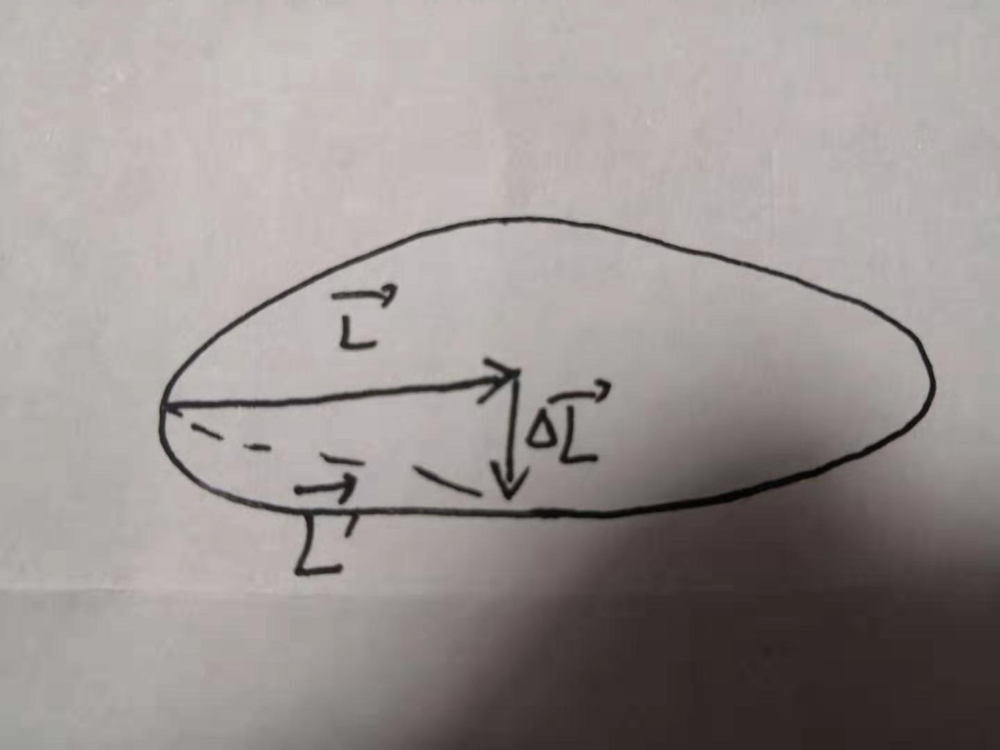

首先推荐一个很不错的教学视频，很短，个视频大概看到5分钟左右就可以了
https://v.youku.com/v_show/id_XMTQ4NDYwMzgw.html?refer=seo_operation.liuxiao.liux_00003310_3000_nUF3ai_19042900  
视频中的老师举了最常见的逆时针旋转的例子，然而大部分朋友有困惑的点在于顺时针旋转，  
先说结论吧  
    逆时针自转的陀螺逆时针进动  
    顺时针自转的陀螺顺时针进动  
逆时针就如视频中的分析一样，顺时针如下图
  
其中L为角动量，$/delta L$为重力带来的力矩，L`为改变后的角动量。L之所以跟逆时针的不同，原因在于顺时针的角动量是朝里的，逆时针是朝外的，所以会有这样的区别。
很多朋友主要犯错的地方在于力矩合成画成了这样
  
但是这个不是力的合成，所以需要先把力矩移动到陀螺中心然后进行合成。
根据上面的力矩合成我们能得出上面的结论。
